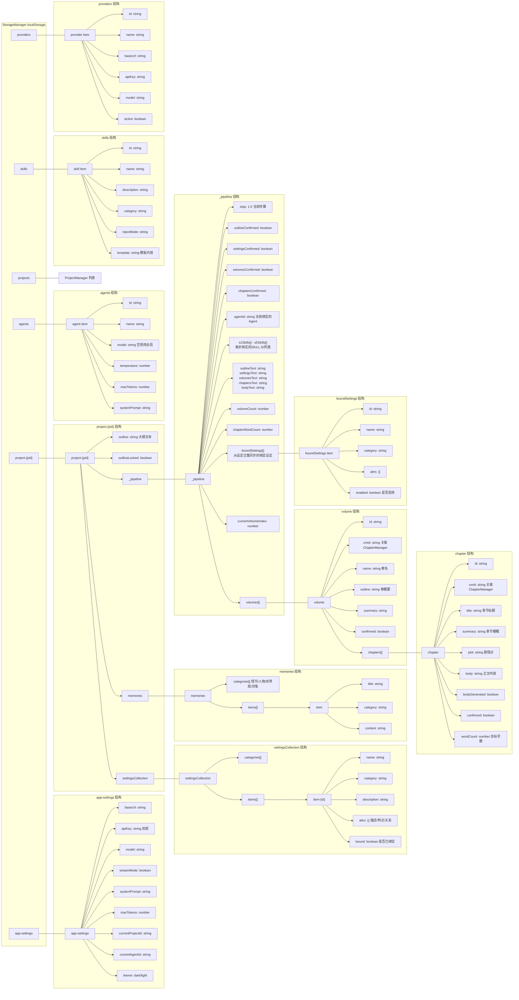
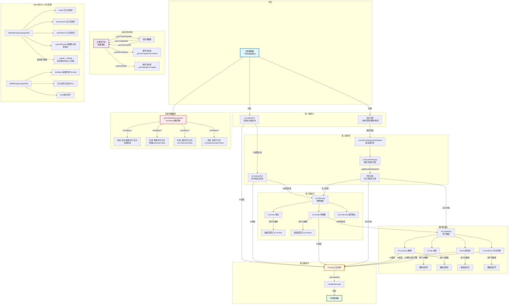
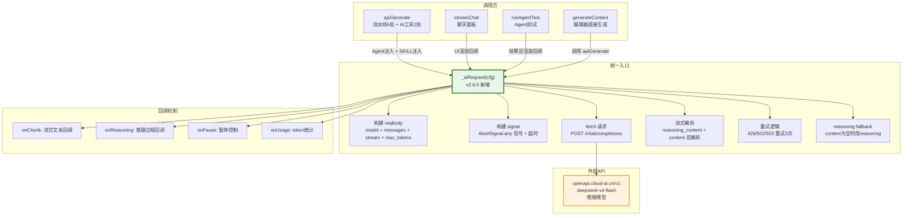
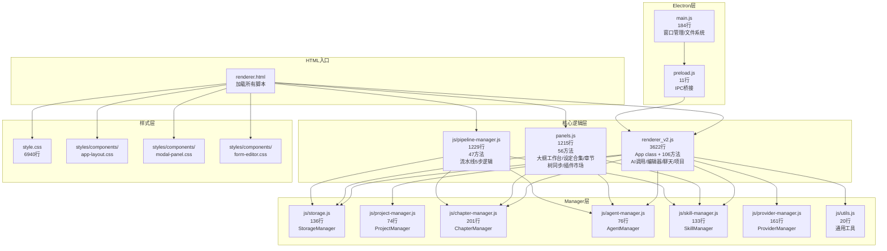

# 写作助手 v2.6.0 完整架构图

> 基于源代码逐行扫描生成，反映 v2.6.0 真实代码结构
> 生成时间：2026-07-24

---

## 一、完整链路图

应用从用户输入到最终正文输出的完整调用链路，包含 AI 调用、数据持久化、UI 联动三个维度。

```mermaid
flowchart TB
    subgraph 入口层
        UE[用户操作<br/>按钮点击/输入]
    end

    subgraph 大纲工作台
        OW[大纲编辑器<br/>outline-editor]
        OW -->|导入文件| importOutlineFile
        OW -->|AI共创| toggleAICoCreate
        OW -->|保存| saveOutlineBlur
        OW -->|锁定| lockOutline
        OW -->|拆解到设定合集| decomposeOutline
        OW -->|同步到流水线| _plLoadOutline
    end

    subgraph 设定合集
        SC[设定合集面板<br/>settingsCollection]
        SC -->|AI生成| _aiGenSettingsItem
        SC -->|手动添加| _addSettingsItem
        SC -->|编辑| _editSettingsItem
        SC -->|绑定| _toggleScBind
        SC -->|保存绑定| _saveScBind
        SC -->|同步到流水线| _syncBoundSettingsToPipeline
    end

    subgraph 生成流水线
        direction TB
        PL1[Step1 大纲<br/>pl-outline]
        PL2[Step2 设定<br/>pl-settings]
        PL3[Step3 卷纲<br/>pl-volumes]
        PL4[Step4 章节<br/>pl-chapters]
        PL5[Step5 正文<br/>pl-body]

        PL1 -->|确认| _plConfirmOutline
        _plConfirmOutline -->|写入| pl.outlineText
        _plConfirmOutline -->|失效下游| _plInvalidateDownstream

        PL2 -->|AI生成| _plGenSettings
        _plGenSettings -->|读取| pl.outlineText
        _plGenSettings -->|读取| _getBoundSettingsText
        _plGenSettings -->|保存| _plSaveSettings
        _plSaveSettings -->|写入| pl.settingsText

        PL3 -->|AI生成| _plGenVolumes
        _plGenVolumes -->|读取| pl.outlineText
        _plGenVolumes -->|读取| pl.settingsText
        _plGenVolumes -->|读取| _getBoundSettingsText
        _plGenVolumes -->|渲染卡片| _plRenderVolumeCards
        PL3 -->|保存| _plSaveVolume
        PL3 -->|确认| _plConfirmVolume

        PL4 -->|AI生成| _plGenChaptersForVolume
        _plGenChaptersForVolume -->|读取| vol.outline
        _plGenChaptersForVolume -->|读取| pl.settingsText
        _plGenChaptersForVolume -->|读取| _getBoundSettingsText
        _plGenChaptersForVolume -->|渲染卡片| _plRenderChapterCards
        PL4 -->|保存| _plSaveChapter
        PL4 -->|确认| _plConfirmChapter

        PL5 -->|AI生成| _plGenBody
        _plGenBody -->|读取| pl.outlineText
        _plGenBody -->|读取| pl.settingsText
        _plGenBody -->|读取| vol.outline
        _plGenBody -->|读取| ch.summary + ch.plot
        _plGenBody -->|读取| _getBoundSettingsText
        _plGenBody -->|写入| _plInsertBody
        _plInsertBody -->|同步| ChapterManager.updateChapter
        PL5 -->|确认| _plConfirmBody
    end

    subgraph AI调用层
        AR[_aiRequest 统一AI请求方法]
        AR -->|stream解析| RC[reasoning_content + content]
        AR -->|重试| RT[429/502/503 重试3次]
        AR -->|超时| TO[300s timeout]

        AG[apiGenerate 流水线+AI工具]
        AG -->|Agent注入| AI1[model + temperature + maxTokens + systemPrompt]
        AG -->|SKILL注入| SK1[skillBlock 追加到 prompt]
        AG -->|调用| AR

        SC2[streamChat 聊天面板]
        SC2 -->|UI回调| UI1[消息气泡 + markdown渲染]
        SC2 -->|调用| AR

        RAT[runAgentTest Agent测试]
        RAT -->|UI回调| UI2[结果区渲染]
        RAT -->|调用| AR
    end

    subgraph 左侧章节树
        CT[章节树面板 快捷操作]
        CT -->|同步到流水线| _syncTreeToPipeline
        CT -->|同步章节编辑| _syncChapterEdit
        CT -->|同步卷纲编辑| _syncVolumeEdit
        CT -->|快捷生成章节| _treeGenChapters
        CT -->|快捷生成正文| _treeGenBody
        _treeGenChapters -->|委托| _plGenChaptersForVolume
        _treeGenBody -->|委托| _plGenBodyForChapter
    end

    subgraph 中间编辑器
        ED[编辑器 editor-content]
        ED -->|AI生成| generateContent
        generateContent -->|读取| pl.outlineText
        generateContent -->|读取| pl.settingsText
        generateContent -->|调用| AG
        ED -->|保存| autoSaveChapter
    end

    subgraph 数据持久化
        SM[StorageManager localStorage封装]
        SM --> SM1["project-{pid}"]
        SM --> SM2[app-settings]
        SM --> SM3[agents]
        SM --> SM4[skills]
        SM --> SM5[providers]
        SM --> SM6[projects列表]
    end

    subgraph Manager层
        PM[ProjectManager]
        CM[ChapterManager]
        AM[AgentManager]
        SKM[SkillManager]
        PVM[ProviderManager]
    end

    UE --> OW
    UE --> SC
    UE --> PL1
    UE --> CT
    UE --> ED

    decomposeOutline -->|写入| SC
    _plLoadOutline -->|读取| PL1

    _syncBoundSettingsToPipeline -->|写入| pl.boundSettings
    _getBoundSettingsText -->|读取| pl.boundSettings

    _plInsertBody --> ED
    ChapterManager.updateChapter --> ED

    PM --> SM6
    CM --> SM1
    AM --> SM3
    SKM --> SM4
    PVM --> SM5

    _plData --> SM1
    _plPersist --> SM1
    _getProjectData --> SM1
    _saveProjectData --> SM1
    _scData --> SM1

    AR -->|fetch| API[外部API openapi.cloud-ai.cn]
```

---

## 二、完整数据结构图

所有存储在 StorageManager 中的数据结构，以及它们之间的嵌套关系。



---

## 三、完整数据内联递归关系图

展示数据如何在各模块之间流动、联动、失效和恢复。核心是"上游改动如何影响下游"。



---

## 附：AI 调用统一链路图

v2.6.0 重构后的 AI 调用架构，所有 AI 请求收拢到 _aiRequest 一个入口。



---

## 附：文件架构图

v2.6.0 的文件拆分后的模块边界。



---

## 数据流总结

| 维度 | 旧版 v2.5.0 | 新版 v2.6.0 |
|:---|:---|:---|
| AI 调用入口 | 3 处独立 fetch | 1 个 _aiRequest 统一入口 |
| 流水线文件 | 混在 panels.js 中 | 独立 js/pipeline-manager.js |
| reasoning_content 解析 | 仅 apiGenerate 有 | 三处统一解析 |
| 重试逻辑 | 仅 apiGenerate 有 | _aiRequest 统一处理 |
| 数据存储 | StorageManager 统一 | 不变（已合理） |
| 设定合集联动 | 单向同步 | 绑定即同步 + enabled 开关 |
| 章节树联动 | 部分同步 | 双向同步 + 快捷委托 |
| 失效传播 | 无 | _plInvalidateDownstream 级联失效 |
