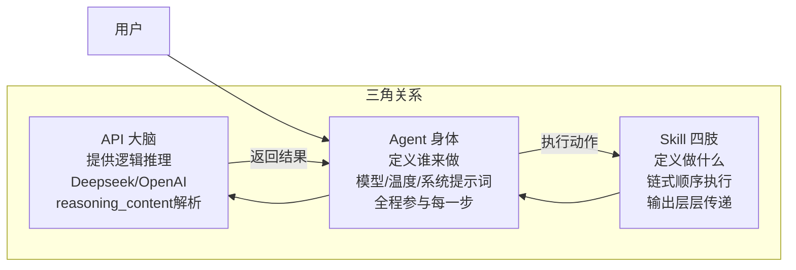
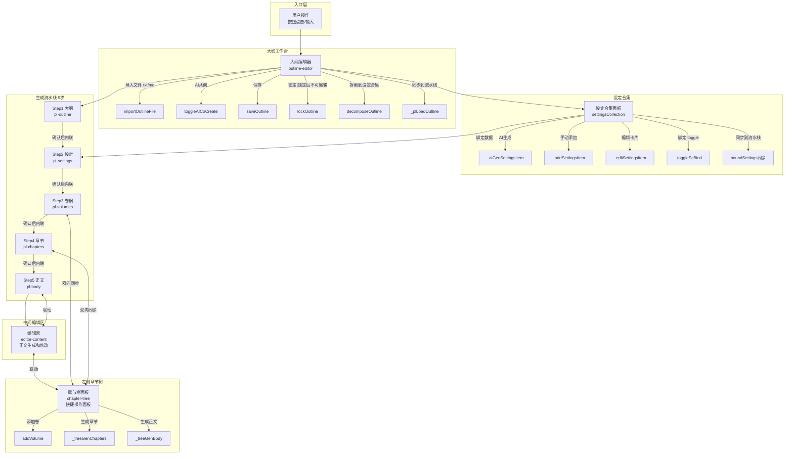
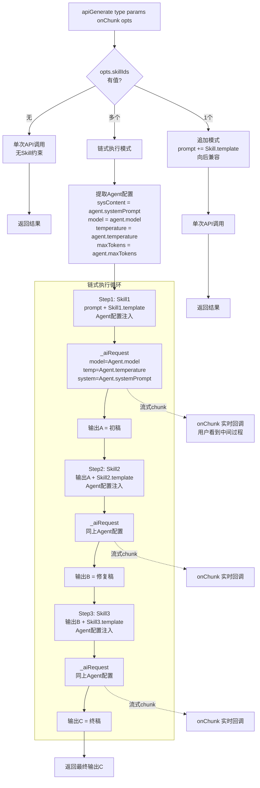
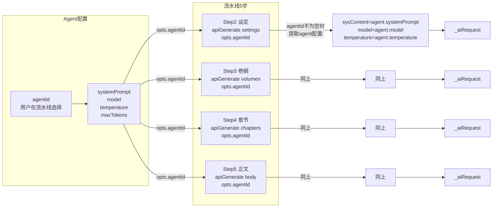
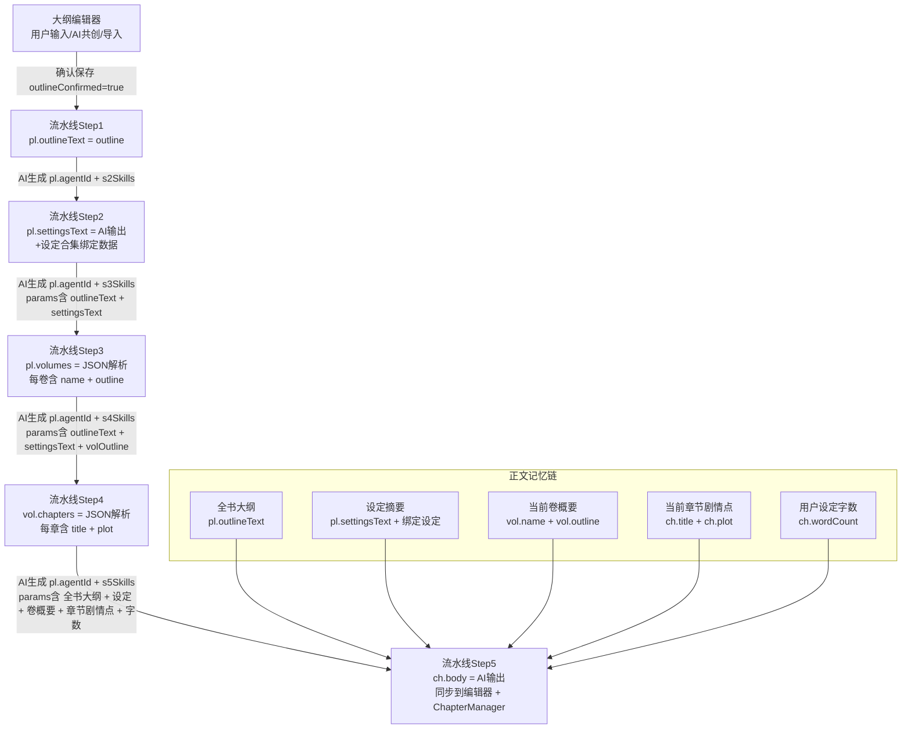
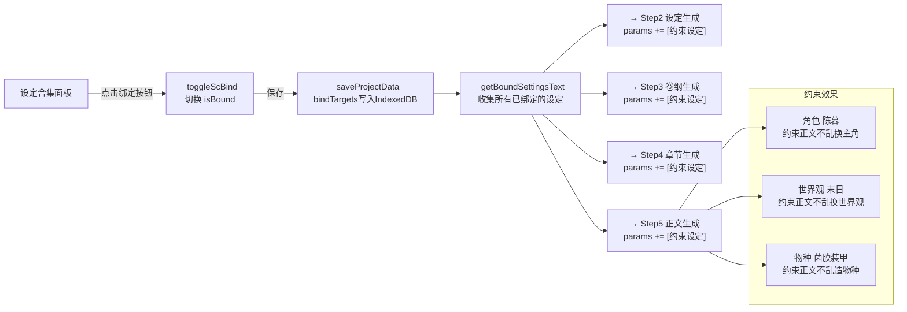
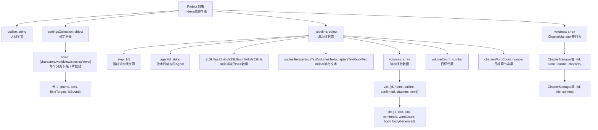
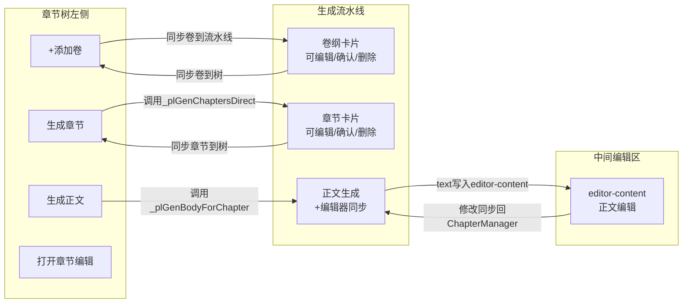
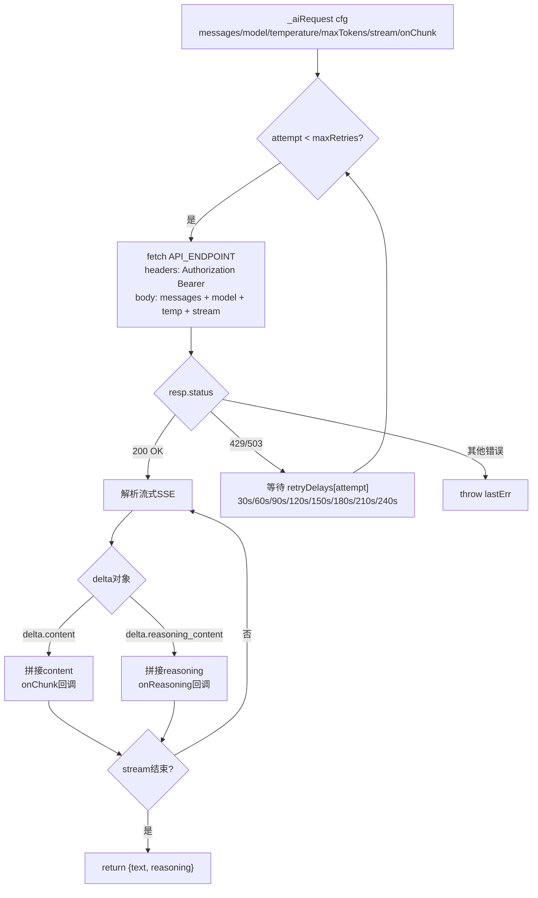

# 写作助手 v2.7.1 完整架构链路图

> 基于 v2.7.1 源代码逐行扫描生成，重点体现 Skill 链式执行 + Agent 全程参与
> 生成时间：2026-07-25
> 核心改动：Skill 从"并行追加"改为"链式执行"，多 Skill 自动按顺序调用

---

## 一、核心架构三角

应用的核心设计哲学：API 是大脑，Agent 是身体，Skill 是四肢。



**职责划分：**
- API（大脑）：每次 `_aiRequest` 调用，处理流式响应 + reasoning_content
- Agent（身体）：提供 model/temperature/systemPrompt/maxTokens，链式每步都携带
- Skill（四肢）：提供 template（执行指令），多个 Skill 按顺序链式执行

---

## 二、完整调用链路图

从用户操作到正文输出的完整调用链路。



---

## 三、Skill 链式执行流程（核心改动）

这是 v2.7.1 最重要的架构改动。多个 Skill 不再拼在一起，而是按顺序链式执行。



**关键规则：**
- 第1步：原始prompt + Skill1.template → API调用1 → 输出A
- 第2步：输出A + Skill2.template → API调用2 → 输出B
- 第3步：输出B + Skill3.template → API调用3 → 输出C
- Agent的model/temperature/systemPrompt/maxTokens 在每一步都注入
- 每步的流式chunk都通过onChunk回调，用户可看到中间过程
- 中间步骤返回空则停止链
- 每步显示toast提示进度（"正在执行技能 2/3: 润色专家"）

---

## 四、Agent 参与全链路图

Agent 在生成流水线的每一步都全程参与。



**代码位置：**
- Agent配置提取：renderer_v2.js 第885-897行
- 链式每步注入：renderer_v2.js 第917-924行（_sysContent/_agentModel/_agentTemperature）
- 流水线调用点：pipeline-manager.js 的 _plGenSettings/_plGenVolumes/_plGenChaptersDirect/_plGenBodyForChapter

---

## 五、数据内联递归关系图

每一步的输出都是下一步的输入，形成内联递归。



**正文生成的完整上下文（pipeline-manager.js _plGenBodyForChapter）：**
```
params = "[全书大纲]\n" + outline
       + "\n\n[设定摘要]\n" + settingsText + boundText
       + "\n\n[当前卷概要]\n" + vol.name + ": " + vol.outline
       + "\n\n[当前章节剧情点]\n" + ch.title + ": " + ch.plot
       + "\n\n请为本章节生成约" + wordCount + "字的正文内容。"
       + "记住这一章节讲的是什么，这一章节在这一卷纲中的位置，"
       + "这一卷纲的主题和概要，以及这一卷纲在大纲里要记住的设定。"
```

---

## 六、设定合集绑定约束链路

设定合集的绑定数据如何影响正文输出。



---

## 七、完整数据结构图



---

## 八、双面板联动关系

章节树（左侧快捷面板）与生成流水线（完整面板）的双向同步。



---

## 九、_aiRequest 内部流程

每次 API 调用的完整内部流程（含重试 + reasoning_content 解析）。



---

## 十、版本变更记录

| 版本 | 日期 | 链路变更 |
|------|------|----------|
| v2.6.0 | 2026-07-24 | 提取_aiRequest公共方法，拆分PipelineManager |
| v2.7.0 | 2026-07-24 | 修复6个客户端问题，reasoning_content解析 |
| v2.7.1 | 2026-07-25 | **Skill链式执行**：多Skill从并行追加改为顺序链式，Agent全程参与每步 |

### v2.7.1 核心改动

**改前（v2.7.0及之前）：**
```
opts.skillIds.forEach(sid => {
    skillBlock += Skill.get(sid).template;  // 拼在一起
});
prompt += skillBlock;
apiRequest(prompt);  // 一次调用
```

**改后（v2.7.1）：**
```
if (skillIds.length === 1) {
    // 单Skill：追加模式（向后兼容）
    prompt += skill.template;
    apiRequest(prompt);
} else {
    // 多Skill：链式执行
    for (each skill in skillIds) {
        prompt = previousOutput + skill.template;
        result = apiRequest(prompt, agentConfig);  // Agent配置每步注入
        previousOutput = result;
    }
    return finalResult;
}
```

**影响范围：**
- 改动文件：renderer_v2.js（apiGenerate方法）
- 不需改动：pipeline-manager.js（调用方传skillIds数组，自动触发链式）
- 不需改动：panels.js（_plAddSkill/_plRemoveSkill存储逻辑不变）
- 向后兼容：单Skill绑定的行为完全不变
