# 生成流水线结构导向图

## 一、整体流程总览

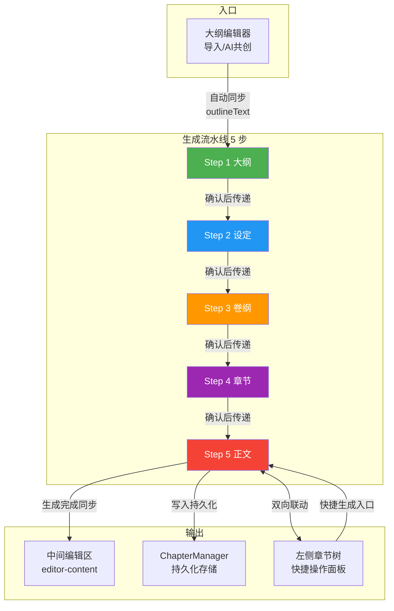

## 二、每一步的详细逻辑导向

### Step 1：大纲

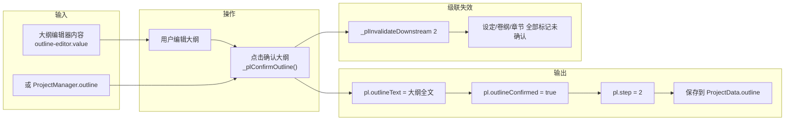

### Step 2：设定

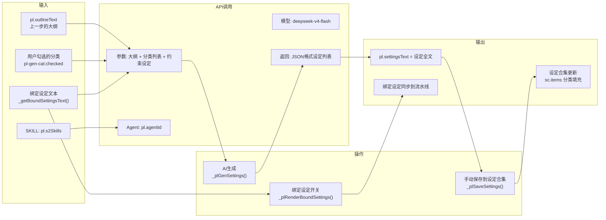

### Step 3：卷纲

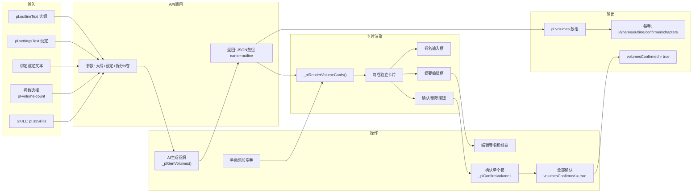

### Step 4：章节

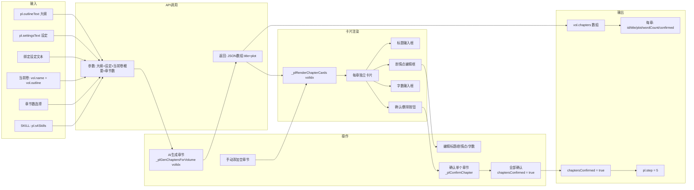

### Step 5：正文

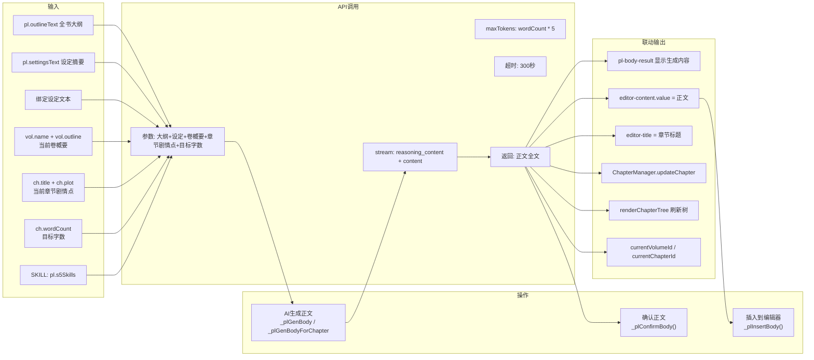

## 三、数据内联递归关系

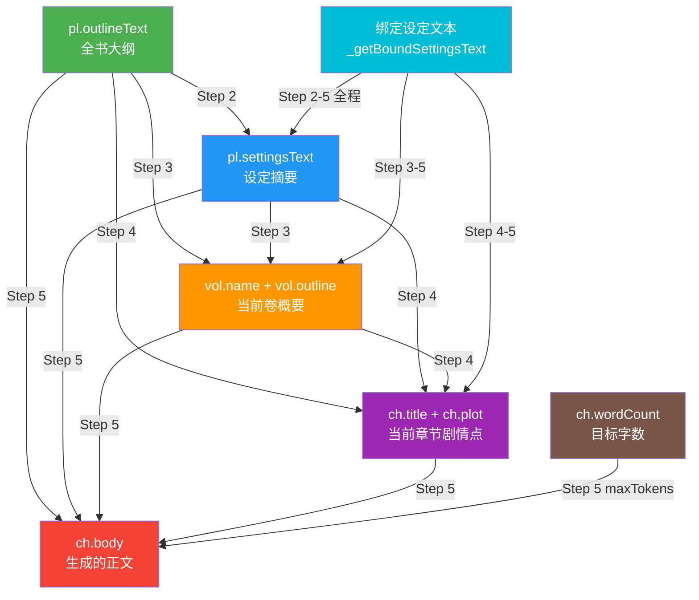

## 四、左侧章节树联动机制

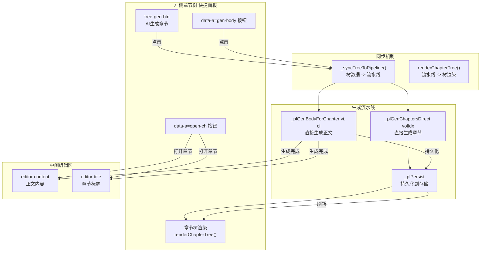

## 五、级联失效机制

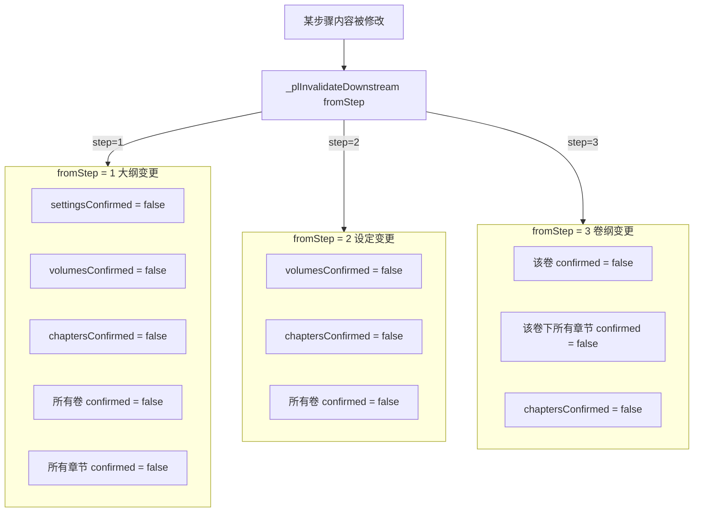

## 六、完整数据结构

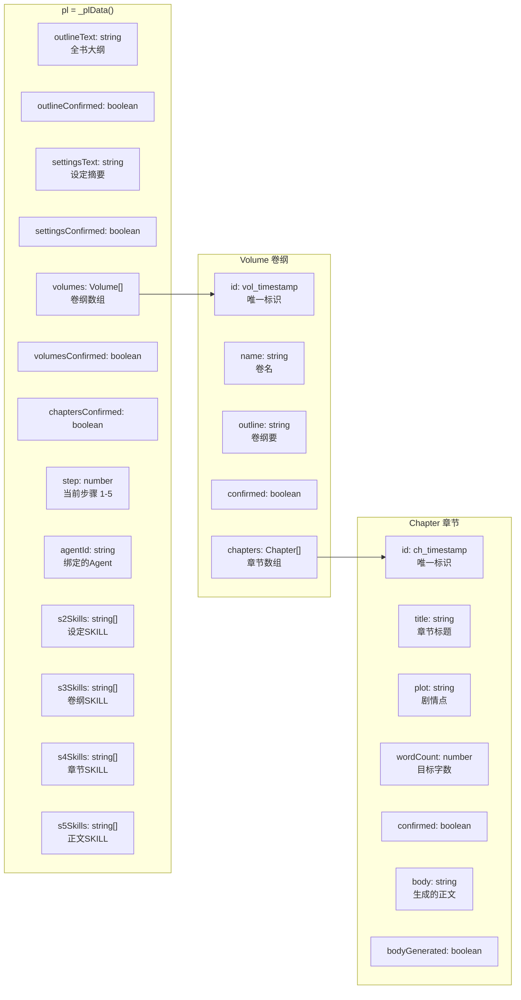

## 七、API 调用链路

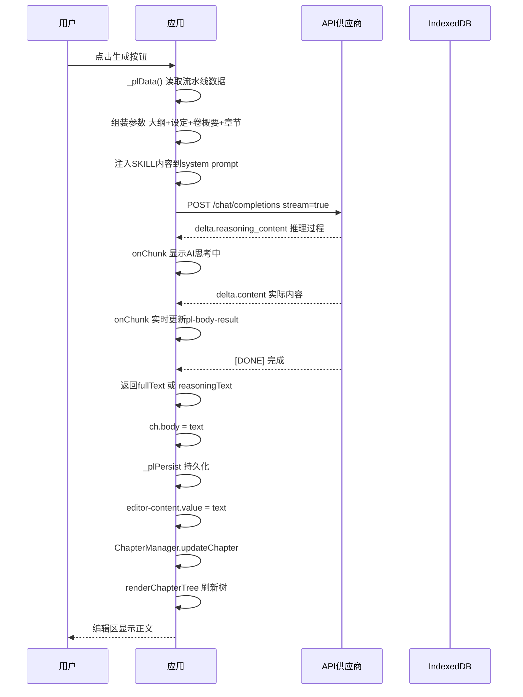

## 八、入口与触发方式汇总

| 步骤 | 触发方式 | 函数 | SKILL字段 |
|:---|:---|:---|:---|
| Step 1 大纲 | 流水线面板确认按钮 | _plConfirmOutline() | 无 |
| Step 1 大纲 | 大纲编辑器保存自动同步 | _plData().outlineText = value | 无 |
| Step 2 设定 | 流水线面板AI生成按钮 | _plGenSettings() | pl.s2Skills |
| Step 2 设定 | 手动保存到设定合集 | _plSaveSettings() | 无 |
| Step 3 卷纲 | 流水线面板AI生成按钮 | _plGenVolumes() | pl.s3Skills |
| Step 3 卷纲 | 手动添加空卷 | _plRenderVolumeCards() | 无 |
| Step 3 卷纲 | 确认单个卷 | _plConfirmVolume(i) | 无 |
| Step 4 章节 | 流水线面板AI生成按钮 | _plGenChaptersForVolume(vi) | pl.s4Skills |
| Step 4 章节 | 左侧树AI生成章节 | _treeGenChapters -> _plGenChaptersDirect(vi) | pl.s4Skills |
| Step 4 章节 | 手动添加空章节 | _plRenderChapterCards() | 无 |
| Step 4 章节 | 确认单个章节 | _plConfirmChapter(vi, ci) | 无 |
| Step 4 章节 | 全部确认进入正文 | _plConfirmAllChapters() | 无 |
| Step 5 正文 | 流水线面板AI生成按钮 | _plGenBody() | pl.s5Skills |
| Step 5 正文 | 左侧树生成按钮 | _treeGenBody -> _plGenBodyForChapter(vi, ci) | pl.s5Skills |
| Step 5 正文 | 插入到编辑器 | _plInsertBody() | 无 |
| Step 5 正文 | 确认正文 | _plConfirmBody() | 无 |

## 九、每步上下文传递内容

| 步骤 | 传递给API的上下文 | 来源 |
|:---|:---|:---|
| Step 2 设定 | 大纲全文 | pl.outlineText |
| Step 2 设定 | 分类列表 | 用户勾选 |
| Step 2 设定 | 约束设定 | _getBoundSettingsText() |
| Step 3 卷纲 | 大纲全文 | pl.outlineText |
| Step 3 卷纲 | 设定摘要 | pl.settingsText |
| Step 3 卷纲 | 约束设定 | _getBoundSettingsText() |
| Step 3 卷纲 | 拆分卷数 | pl-volume-count |
| Step 4 章节 | 大纲全文 | pl.outlineText |
| Step 4 章节 | 设定摘要 | pl.settingsText |
| Step 4 章节 | 约束设定 | _getBoundSettingsText() |
| Step 4 章节 | 当前卷名+纲要 | vol.name + vol.outline |
| Step 4 章节 | 章节数 | pl-volume-count |
| Step 5 正文 | 大纲全文 | pl.outlineText |
| Step 5 正文 | 设定摘要 | pl.settingsText |
| Step 5 正文 | 约束设定 | _getBoundSettingsText() |
| Step 5 正文 | 当前卷名+纲要 | vol.name + vol.outline |
| Step 5 正文 | 章节标题+剧情点 | ch.title + ch.plot |
| Step 5 正文 | 目标字数 | ch.wordCount |
| Step 5 正文 | maxTokens | wordCount * 5 |
| 全步骤 | Agent | pl.agentId |
| 全步骤 | SKILL | 对应步骤的 sNSkills |

## 十、存储位置

| 数据 | 存储位置 | 格式 |
|:---|:---|:---|
| 流水线完整数据 | wa_project-{pid}.json 的 _pipeline 字段 | JSON |
| 章节内容 | wa_chapters_{pid}.json | JSON |
| 设定合集 | 项目数据的 settingsCollection | JSON |
| 项目基本信息 | wa_projects.json | JSON |
| 存储目录 | %APPDATA%/writing-assistant/data/ | 文件系统 |
